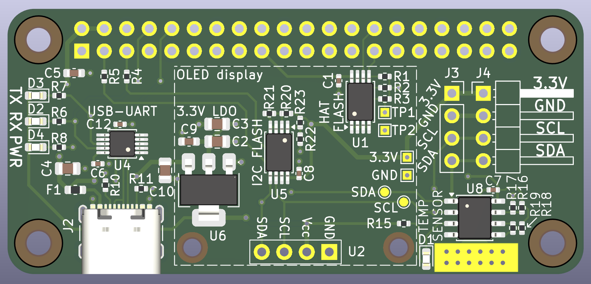

# I2C Peripherals Board for Raspberry Pi Zero

The board was developed for communicating some I2C peripherals connected to a Raspberry Pi Zero.

## Schematics


## 3D Model




## Questions? Suggestions?

You are more than welcome to contact me with any questions, suggestions or propositions regarding this project. Please drop an email to ```iosaaris =at= gmail dot com```.

## How to Support or Say Thanks

If you like this project, or found here some useful information and want to say thanks, or encourage me to do more, you can buy me a coffee!

[](https://ko-fi.com/Q5Q4ITR7J)

[](https://www.buymeacoffee.com/4x1md)


---

73 de 4X1MD
